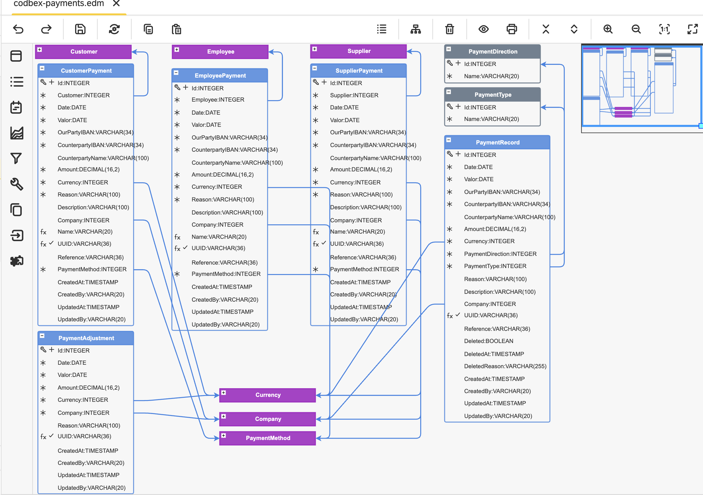

#  codbex-invoices

## 📖 Table of Contents
* [🗺️ Entity Data Model (EDM)](#️-entity-data-model-edm)
* [🧩 Core Entities](#-core-entities)
* [📦 Dependencies](#-dependencies)
* [🔗 Sample Data Modules](#-sample-data-modules)
* [🐳 Local Development with Docker](#-local-development-with-docker)

## 🗺️ Entity Data Model (EDM)



## 🧩 Core Entities

### Entity: `SalesInvoice`

| Field         | Type      | Details                      | Description            |
| ------------- | --------- | ---------------------------- | ---------------------- |
| Id            | INTEGER   | PK, Identity                 | Unique identifier.     |
| Number        | VARCHAR   | Length: 20, Unique, Nullable | Invoice number.        |
| Type          | INTEGER   | FK                           | Invoice type.          |
| Customer      | INTEGER   | FK                           | Reference to customer. |
| Date          | DATE      |                              | Invoice date.          |
| Due           | DATE      |                              | Due date.              |
| Net           | DECIMAL   | Precision: 16, Scale: 2      | Net amount.            |
| Currency      | INTEGER   | FK                           | Currency reference.    |
| Gross         | DECIMAL   | Precision: 16, Scale: 2      | Gross amount.          |
| Discount      | DECIMAL   | Default: 0                   | Discount.              |
| Taxes         | DECIMAL   | Default: 0                   | Additional taxes.      |
| Vat           | DECIMAL   | Precision: 16, Scale: 2      | VAT amount.            |
| Total         | DECIMAL   | Default: 0                   | Total amount.          |
| Paid          | DECIMAL   | Default: 0                   | Paid amount.           |
| Conditions    | VARCHAR   | Length: 200, Nullable        | Conditions.            |
| PaymentMethod | INTEGER   | FK, Nullable                 | Payment method.        |
| SentMethod    | INTEGER   | FK, Nullable                 | Sending method.        |
| Status        | INTEGER   | FK                           | Invoice status.        |
| Operator      | INTEGER   | FK                           | Responsible employee.  |
| DocumentLink  | VARCHAR   | Length: 1000                 | Document link.         |
| Company       | INTEGER   | FK                           | Company reference.     |
| Name          | VARCHAR   | Length: 200                  | Name.                  |
| Uuid          | VARCHAR   | Length: 36, Unique           | UUID.                  |
| Process       | VARCHAR   | Length: 36, Nullable         | Process reference.     |
| Reference     | VARCHAR   | Length: 100, Nullable        | External reference.    |
| CreatedAt     | TIMESTAMP | Nullable                     | Created at.            |
| CreatedBy     | VARCHAR   | Length: 20, Nullable         | Created by.            |
| UpdatedAt     | TIMESTAMP | Nullable                     | Updated at.            |
| UpdatedBy     | VARCHAR   | Length: 20, Nullable         | Updated by.            |

### Entity `SalesInvoiceItem`

| Field        | Type      | Details                 | Description           |
| ------------ | --------- | ----------------------- | --------------------- |
| Id           | INTEGER   | PK, Identity            | Unique identifier.    |
| SalesInvoice | INTEGER   | FK                      | Reference to invoice. |
| Name         | VARCHAR   | Length: 300             | Item name.            |
| Quantity     | DOUBLE    |                         | Quantity.             |
| Uom          | INTEGER   | FK                      | Unit of measure.      |
| Price        | DECIMAL   | Precision: 16, Scale: 2 | Unit price.           |
| Net          | DECIMAL   | Precision: 16, Scale: 2 | Net amount.           |
| VatRate      | DECIMAL   | Default: 20             | VAT rate.             |
| Vat          | DECIMAL   | Precision: 16, Scale: 2 | VAT amount.           |
| Gross        | DECIMAL   | Precision: 16, Scale: 2 | Gross amount.         |
| CreatedAt    | TIMESTAMP | Nullable                | Created at.           |
| CreatedBy    | VARCHAR   | Length: 20, Nullable    | Created by.           |
| UpdatedAt    | TIMESTAMP | Nullable                | Updated at.           |
| UpdatedBy    | VARCHAR   | Length: 20, Nullable    | Updated by.           |

### Entity `PurchaseInvoice`

| Field               | Type      | Details                      | Description              |
| ------------------- | --------- | ---------------------------- | ------------------------ |
| Id                  | INTEGER   | PK, Identity                 | Unique identifier.       |
| Number              | VARCHAR   | Length: 20, Unique, Nullable | Internal number.         |
| OriginalNumber      | VARCHAR   | Length: 20                   | Supplier invoice number. |
| PurchaseInvoiceType | INTEGER   | FK                           | Invoice type.            |
| Date                | DATE      |                              | Invoice date.            |
| Due                 | DATE      |                              | Due date.                |
| Supplier            | INTEGER   | FK                           | Supplier reference.      |
| Net                 | DECIMAL   | Precision: 16, Scale: 2      | Net amount.              |
| Currency            | INTEGER   | FK                           | Currency reference.      |
| Gross               | DECIMAL   | Precision: 16, Scale: 2      | Gross amount.            |
| Discount            | DECIMAL   | Default: 0                   | Discount.                |
| Taxes               | DECIMAL   | Default: 0                   | Taxes.                   |
| Vat                 | DECIMAL   | Precision: 16, Scale: 2      | VAT.                     |
| Total               | DECIMAL   | Default: 0                   | Total.                   |
| Paid                | DECIMAL   | Default: 0                   | Paid.                    |
| Conditions          | VARCHAR   | Length: 200, Nullable        | Conditions.              |
| PaymentMethod       | INTEGER   | FK, Nullable                 | Payment method.          |
| SentMethod          | INTEGER   | FK, Nullable                 | Sending method.          |
| Status              | INTEGER   | FK                           | Status.                  |
| Operator            | INTEGER   | FK                           | Responsible employee.    |
| DocumentLink        | VARCHAR   | Length: 1000                 | Document link.           |
| Company             | INTEGER   | FK, Nullable                 | Company reference.       |
| Name                | VARCHAR   | Length: 200                  | Name.                    |
| Uuid                | VARCHAR   | Length: 36, Unique           | UUID.                    |
| Process             | VARCHAR   | Length: 36, Nullable         | Process.                 |
| Reference           | VARCHAR   | Length: 36, Nullable         | Reference.               |
| CreatedAt           | TIMESTAMP | Nullable                     | Created at.              |
| CreatedBy           | VARCHAR   | Length: 20, Nullable         | Created by.              |
| UpdatedAt           | TIMESTAMP | Nullable                     | Updated at.              |
| UpdatedBy           | VARCHAR   | Length: 20, Nullable         | Updated by.              |

### Entity `PurchaseInvoiceItem`

| Field           | Type      | Details                           | Description           |
| --------------- | --------- | --------------------------------- | --------------------- |
| Id              | INTEGER   | PK, Identity                      | Unique identifier.    |
| PurchaseInvoice | INTEGER   | FK                                | Reference to invoice. |
| Name            | VARCHAR   | Length: 300                       | Item name.            |
| Quantity        | DOUBLE    |                                   | Quantity.             |
| Uom             | INTEGER   | FK                                | Unit of measure.      |
| Price           | DECIMAL   | Precision: 16, Scale: 2           | Price.                |
| Net             | DECIMAL   | Precision: 16, Scale: 2, Nullable | Net.                  |
| VatRate         | DECIMAL   | Default: 20                       | VAT rate.             |
| Vat             | DECIMAL   | Precision: 16, Scale: 2, Nullable | VAT.                  |
| Gross           | DECIMAL   | Precision: 16, Scale: 2, Nullable | Gross.                |
| CreatedAt       | TIMESTAMP | Nullable                          | Created at.           |
| CreatedBy       | VARCHAR   | Length: 20, Nullable              | Created by.           |
| UpdatedAt       | TIMESTAMP | Nullable                          | Updated at.           |
| UpdatedBy       | VARCHAR   | Length: 20, Nullable              | Updated by.           |

### Entity `SalesInvoiceStatus`

| Field | Type    | Details      | Description        |
| ----- | ------- | ------------ | ------------------ |
| Id    | INTEGER | PK, Identity | Unique identifier. |
| Name  | VARCHAR | Length: 20   | Status name.       |

### Entity `PurchaseInvoiceStatus`

| Field | Type    | Details      | Description        |
| ----- | ------- | ------------ | ------------------ |
| Id    | INTEGER | PK, Identity | Unique identifier. |
| Name  | VARCHAR | Length: 20   | Status name.       |

### Entity `SalesInvoicePayment`

| Field           | Type      | Details                 | Description                 |
| --------------- | --------- | ----------------------- | --------------------------- |
| Id              | INTEGER   | PK, Identity            | Unique identifier.          |
| SalesInvoice    | INTEGER   | FK, Nullable            | Invoice reference.          |
| CustomerPayment | INTEGER   | FK, Nullable            | Customer payment reference. |
| Amount          | DECIMAL   | Precision: 16, Scale: 2 | Amount applied.             |
| CreatedAt       | TIMESTAMP | Nullable                | Created at.                 |
| CreatedBy       | VARCHAR   | Length: 20, Nullable    | Created by.                 |
| UpdatedAt       | TIMESTAMP | Nullable                | Updated at.                 |
| UpdatedBy       | VARCHAR   | Length: 20, Nullable    | Updated by.                 |

### Entity `PurchaseInvoicePayment`

| Field           | Type      | Details                 | Description                 |
| --------------- | --------- | ----------------------- | --------------------------- |
| Id              | INTEGER   | PK, Identity            | Unique identifier.          |
| PurchaseInvoice | INTEGER   | FK, Nullable            | Invoice reference.          |
| SupplierPayment | INTEGER   | FK, Nullable            | Supplier payment reference. |
| Amount          | DECIMAL   | Precision: 16, Scale: 2 | Amount applied.             |
| CreatedAt       | TIMESTAMP | Nullable                | Created at.                 |
| CreatedBy       | VARCHAR   | Length: 20, Nullable    | Created by.                 |
| UpdatedAt       | TIMESTAMP | Nullable                | Updated at.                 |
| UpdatedBy       | VARCHAR   | Length: 20, Nullable    | Updated by.                 |

### Entity `SalesInvoiceType`

| Field     | Type    | Details      | Description        |
| --------- | ------- | ------------ | ------------------ |
| Id        | INTEGER | PK, Identity | Unique identifier. |
| Name      | VARCHAR | Length: 20   | Type name.         |
| Direction | INTEGER | FK           | Payment direction. |

### Entity `PurchaseInvoiceType`

| Field     | Type    | Details      | Description        |
| --------- | ------- | ------------ | ------------------ |
| Id        | INTEGER | PK, Identity | Unique identifier. |
| Name      | VARCHAR | Length: 20   | Type name.         |
| Direction | INTEGER | FK           | Payment direction. |

### Entity `Deduction`

| Field            | Type    | Details      | Description                  |
| ---------------- | ------- | ------------ | ---------------------------- |
| Id               | INTEGER | PK, Identity | Unique identifier.           |
| DeductionInvoice | INTEGER | FK, Nullable | Deduction invoice reference. |
| AdvanceInvoice   | INTEGER | FK, Nullable | Advance invoice reference.   |

## 📦 Dependencies

- [codbex-countries](https://github.com/codbex/codbex-countries)
- [codbex-companies](https://github.com/codbex/codbex-companies)
- [codbex-currencies](https://github.com/codbex/codbex-currencies)
- [codbex-uoms](https://github.com/codbex/codbex-uoms)
- [codbex-partners](https://github.com/codbex/codbex-partners)
- [codbex-methods](https://github.com/codbex/codbex-methods)
- [codbex-employees](https://github.com/codbex/codbex-employees)
- [codbex-payments](https://github.com/codbex/codbex-payments)
- [codbex-navigation-groups](https://github.com/codbex/codbex-navigation-groups)
- [codbex-number-generato](https://github.com/codbex/codbex-number-generato)
- [codbex-number-generator-data](https://github.com/codbex/codbex-number-generator-data)

## 🔗 Sample Data Modules

- [codbex-invoices-data](https://github.com/codbex/codbex-invoices-data)

## 🐳 Local Development with Docker

When running this project inside the codbex Atlas Docker image, you must provide authentication for installing dependencies from GitHub Packages.
1. Create a GitHub Personal Access Token (PAT) with `read:packages` scope.
2. Pass `NPM_TOKEN` to the Docker container:

    ```
    docker run \
    -e NPM_TOKEN=<your_github_token> \
    --rm -p 80:80 \
    ghcr.io/codbex/codbex-atlas:latest
    ```

⚠️ **Notes**
- The `NPM_TOKEN` must be available at container runtime.
- This is required even for public packages hosted on GitHub Packages.
- Never bake the token into the Docker image or commit it to source control.